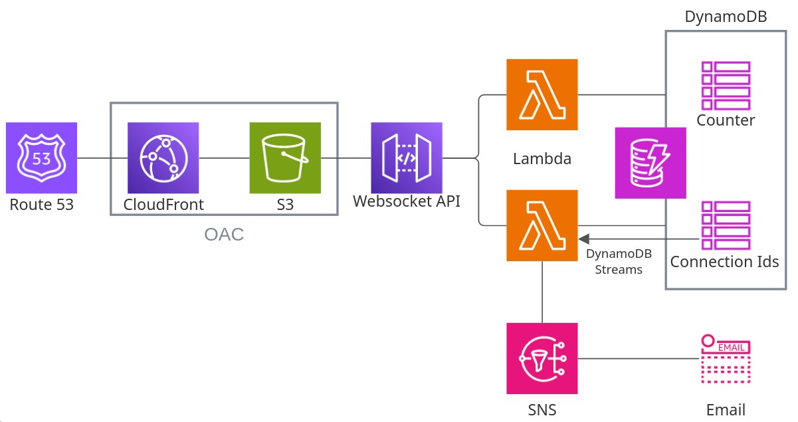

cloud_resume_challenge_aws
# Cloud Resume Challenge - AWS Edition

  

## Introduction

Welcome to my Cloud Resume Challenge project! This repository showcases my skills in deploying a simple static website using AWS services

## Project Overview

The Cloud Resume Challenge is a project that aims to demonstrate proficiency in various AWS services by creating and deploying a resume website in the cloud. The project involves setting up a static website, securing it with SSL, and implementing continuous integration and continuous deployment (CI/CD) pipelines. The project has been extended to include a real-time visitor counter with web sockets and DynamoDB Streams.

## Project Structure

- **/webpage:** Contains the source code for the static resume website.
- **/terraform:** Terraform files for provisioning the required resources.
- **/websockets-app:** SAM (Serverless Application Model) application for deploying Lambda function.
- **/websockets-response-app:** SAM (Serverless Application Model) application for deploying Lambda function.
- **tests:** Contains the unit tests for the Lambda function and website

## Technologies Used

- **AWS Services:**
  - S3 (Simple Storage Service) for hosting static website files
  - CloudFront for content delivery and SSL termination
  - ACM (AWS Certificate Manager) for managing SSL certificates
  - Route 53 for domain registration and DNS
  - DynamoDB tables for storing visit counter data and connection id's
  - DynamoDB Streams for invoking Lambda function
  - SNS for sending notifications
  - API Gateway for exposing API
  - Lambda functions for handling websockets
  - AWS SAM for deploying Lambda function
  - Amazon WorkMail for email hosting
  
- **Others::**
  - Python Pytest for testing
  - JavaScript code for connecting to API
  - Modified page template for resume
  - Terraform for provisioning AWS resources
  - Github Actions for CI/CD pipelines

